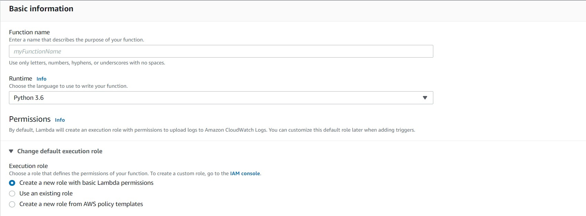
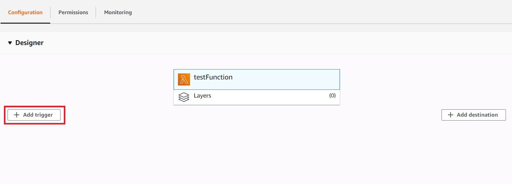
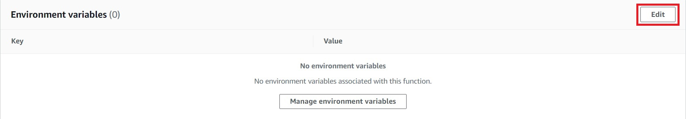
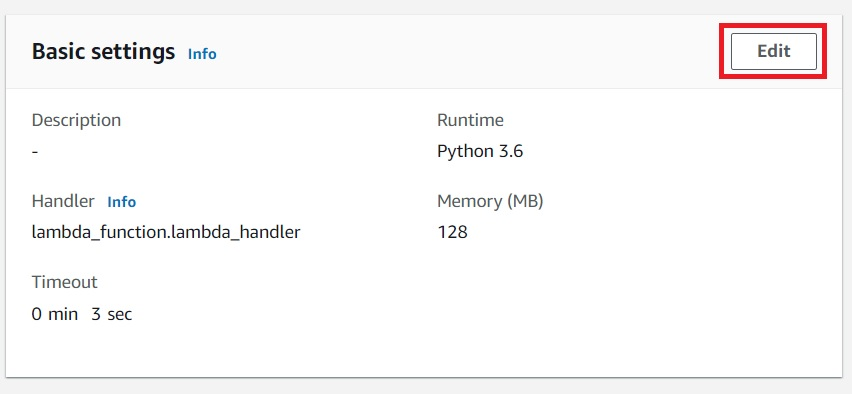
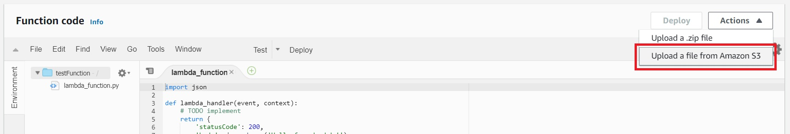

Selenium WebDriver is a powerful tool used for browser automation. It can be very useful for completing tasks such as testing web applications or web scraping. In certain cases, it may be more convenient to run these automations remotely - perhaps to reduce strain on your local resources or to perform identical tasks repeatedly on a schedule. A convenient solution to this is to run your automations on AWS Lambda. However, it can be quite challenging and inconvenient to add this functionality to your web automations. This is where the [Lambda Selenium Starter](https://github.com/OpenLoopHealth/OpenLoopHealth.com) comes in. Follow this guide to begin developing your first web automation (in Python) with selenium on AWS Lambda.

### Background

During my time as an intern at [OpenLoop Health](https://openloophealth.com/), I developed many web scrapers in Python to collect information and perform repeated tasks. I realized that I would save a lot of time if I didn't have to allocate my local resources to run those functions. After writing many web scrapers and hosting one on AWS Lamda the hard way, I knew there had to be an easier way. On my own time, I began developing a starter to simplify the process of deploying web automations to AWS Lambda. An initial template and guide was provided by [21 Buttons](https://github.com/jairovadillo/pychromeless/). After lots of struggling, I developed a solution to seamlessly deploy web automations to AWS Lambda without changing the development process or requiring any additional knowledge outside of selenium commands.  

---

### Requirements

Before we get started, you'll need access to the following:

- [Install Docker](https://docs.docker.com/engine/installation/#get-started)
- [Install Docker Compose](https://docs.docker.com/compose/install/#install-compose)
- An AWS account 

---

### Initial Development

First, head over to the [repository](https://github.com/OpenLoopHealth/lambda-selenium-starter) where the starter is found and clone it. Navigate to `lambda_function.py` to view a sample automation program. This is where you will develop your web automation. You can write your selenium functions as usual with three minor changes: 

1. Any time you need to use the driver methods, your function needs to accept `driver` as a parameter. Let's look at a quick example:

```:title=lambda_function.py {2}
def google(driver):
  driver.get("www.google.com")
  print("You made it to Google!")
```

Because our function, google, uses a *driver method* to load a page, the function must accept the driver instance. Now, let's look at another example:

```:title=lambda_function.py
def smile():
  print("A smile looks great on you!")
```

Because our function, smile, doesn't use any *driver methods*, we don't need it to accept the driver instance. 

2. Make sure that your main function call comes from `lambda_handler`, as that's what Lambda looks for when it's run. 

3. If you add any additional imports (that require installation), be sure to add them in `requirements.txt`. Check out the file to see what it looks like. Essentially, you'll need to include the name and the version of the package you'd like to use.

If you want to see what files you might be modifying or adding in a typical web automation, check out this [gist](https://gist.github.com/noahsburroughs/37f5746ea55f0bc9a9228cea164fec52). Notice how I wanted to include the package `python-dotenv`, so I added it to `requirements.txt`. In addition, you can see how I added a `.env` file to store sensitive information (login credentials in our case) which can easily be accessed with this import. Cool, right?

--- 

### Testing Locally

It's much easier to test your function locally in docker than to debug the errors in AWS. Once you've added all the necessary dependencies for your function, use docker to run:

```noLineNumbers
make fetch-dependencies
```

To run your function locally, use: 

```noLineNumbers
make docker-run
```

Once you're happy with the results, you can move on to building the distributable package

---

### Building the distributable package

To create a `.zip` file that will later be uploaded to AWS Lambda, run the following docker command: 

```noLineNumbers
make build-lambda-package
```

---


### AWS Lambda Setup 

Lambda is Amazon’s serverless application platform. It lets you write or upload a script that runs according to various triggers you give it. For example, it can be run every day at a certain time. If you want to read more about lambda, check [this](https://docs.aws.amazon.com/lambda/latest/dg/welcome.html) out.

1. Go to [AWS Lambda](https://console.aws.amazon.com/lambda/) and hit "Create a new function" 

2. Choose "Author from Scratch". Give it a function name, and choose Python 3.6 as the runtime. For now, we'll leave the permissions as the default. Click "Create function"



3. Optional: Now that you're in the main Lambda dashboard, you can configure your function to run at specific times. Click on "Add trigger" and choose "EventBridge (CloudWatch Events)"



From there, you can create a new rule or use an existing one. The *schedule expression* accepts cron expressions. For more on cron syntax, read [this](https://docs.aws.amazon.com/lambda/latest/dg/tutorial-scheduled-events-schedule-expressions.html). As a quick example, if I wanted to run my automation every morning at 3 AM GST, I'd use the following:

```noLineNumbers
cron(0 3 * * ? *)
```

Click add to save your trigger

4. Next, let's set up our environment variables. Because we're uploading a Chrome browser, we need to tell Lambda where to find it. Navigate to "Environment variables" on your function page and click "Edit"



Click "Add environment variable" and add the following:

```
PATH = /var/task/bin
PYTHONPATH = /var/task/src:/var/task/lib
```

Hit save after you've confirmed you have added the two environment variables correctly

5. Optional: Edit your basic settings. Depending on what your function does, it may require additional memory or time to run. You can modify this under "Basic settings"



Notes: Lambda won't use more memory than you specify (and will terminate if you do), but if you specify more than it needs, you won't be billed for what it doesn't use. Additionally, consider 'timeout' to mean 'time to run function'. Make sure you allocate enough time to your function or it may be terminated early. The maximum time Lambda allows is 15 minutes - if you think your automation will require more, then you might want to consider other alternatives.

6. Upload your function. If you've tested your function and are happy with it, it's time to upload it! Typically, this will require uploading a file from Amazon S3. Upload your .zip to S3 and then upload it to your function code. 



--- 

### Run your automation

Congrats on making it this far! To invoke your function with the AWS CLI, you can run the following command:

```noLineNumbers
aws lambda invoke --function-name yourFunctionName out --log-type Tail
```

Viola! You now have an automation deployed and running on AWS Lambda 🚀

---

### Closing Remarks

While this guide details how to develop and upload an automation to AWS Lambda, you can do much more than that! As a quick example, you can read/write to S3 (see `requirements.txt`) with just a few small changes. Consider this your invitation to explore additional functionality you can add to your web automation!

---

### Shouts to

- Robert Rocha's [guide](https://robertorocha.info/setting-up-a-selenium-web-scraper-on-aws-lambda-with-python/)
- 21 Button's [repo](https://github.com/jairovadillo/pychromeless)
